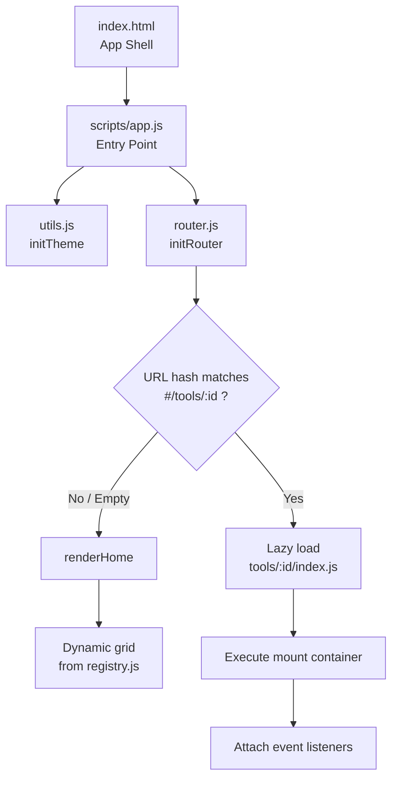

# Tài liệu Kiến trúc Hệ thống ToolHub (Architecture Documentation)

Tài liệu này mô tả chi tiết kiến trúc thiết kế, luồng xử lý và hướng dẫn phát triển cho dự án **ToolHub** — một nền tảng tổng hợp các công cụ tiện ích chạy hoàn toàn trên Client-side (trình duyệt).

---

## 1. Nguyên tắc Thiết kế & Công nghệ (Design Principles & Tech Stack)

ToolHub được xây dựng dựa trên triết lý **tối giản, hiệu năng cao và dễ mở rộng**:

*   **Zero Build step & No Dependencies**: Không sử dụng bundler (Webpack/Vite), không dùng framework (React/Vue/Angular), và không dùng package manager (`npm`/`yarn`) cho runtime. Dự án chạy trực tiếp trên bất kỳ static file server nào.
*   **Vanilla ES Modules (ESM)**: Tận dụng cơ chế import/export gốc của trình duyệt giúp lazy-load mã nguồn từng công cụ chỉ khi cần thiết.
*   **Hash-based Client-side Routing**: Sử dụng URL hash (`#/tools/id`) để quản lý trạng thái điều hướng mà không cần cấu hình server-side redirect (hoạt động tốt ngay cả trên Github Pages hoặc local file servers).
*   **Modern CSS System (OKLCH Color Space)**: Sử dụng các biến CSS variables (CSS Custom Properties) cùng dải màu `oklch()` hiện đại hỗ trợ Dark/Light mode mượt mà, đồng bộ.
*   **Security by Design**: Xử lý toàn bộ logic ngay trên trình duyệt thông qua API JavaScript bảo mật (như `crypto.getRandomValues`). Không có dữ liệu nào được gửi về máy chủ.

---

## 2. Luồng hoạt động của Ứng dụng (Application Flow)



### Chi tiết luồng điều hướng:
1.  **Khởi tạo (App Booting)**:
    *   `app.js` khởi chạy -> gọi `initTheme()` để áp dụng giao diện tối/sáng phù hợp dựa trên `localStorage` hoặc cấu hình hệ thống (`prefers-color-scheme`).
    *   `initRouter()` được kích hoạt, đăng ký sự kiện lắng nghe sự thay đổi URL (`hashchange`).
2.  **Trang chủ (Home View)**:
    *   Nếu Hash URL trống hoặc là `#/.`, router render danh sách thẻ công cụ (Tool Cards) được đọc động từ `scripts/registry.js`.
    *   Người dùng có thể tìm kiếm thời gian thực (real-time search) hoặc lọc (filter) theo danh mục nhờ hàm `filterAndSearch()` trong `router.js`.
3.  **Trang Công cụ (Tool View)**:
    *   Khi người dùng nhấn "Mở" hoặc đi tới `#/tools/{tool-id}`, router hiển thị màn hình chờ (Skeleton loading) và gọi dynamic import:
        ```javascript
        const mod = await import('../tools/' + id + '/index.js');
        mod.mount(appEl);
        ```
    *   Hàm `mount()` của module công cụ sẽ render giao diện riêng biệt và bind các sự kiện tương tác tương ứng.

---

## 3. Cấu trúc thư mục (Directory Structure)

```
ToolHub/
├── index.html                  # App Shell chính (Header, Main container, Footer)
├── styles/
│   ├── tokens.css              # Định nghĩa Hệ thống biến thiết kế (Colors, Spacing, Typography)
│   ├── base.css                # CSS Reset cơ bản và font-family mặc định
│   ├── components.css          # Định dạng chung: Header, Hero, Card, Toast, Button
│   └── tools.css               # Các layout chung dùng cho giao diện của Tool
├── scripts/
│   ├── app.js                  # Entry point khởi chạy ứng dụng
│   ├── registry.js             # File đăng ký danh sách tool (Source of Truth)
│   ├── router.js               # Quản lý Router và các logic view trang chủ
│   └── utils.js                # Các hàm tiện ích dùng chung (Toast, Clipboard, Debounce, Theme)
└── tools/
    ├── vi-name-generator/      # Trình tạo tên tiếng Việt
    ├── password-generator/     # Tạo mật khẩu mạnh an toàn
    ├── lorem-ipsum/            # Bộ sinh văn bản mẫu Latin
    ├── json-formatter/         # Format, Validate & Minify JSON
    ├── uuid-ulid-generator/    # Tạo mã định danh duy nhất UUID / ULID
    ├── base64/                 # Mã hóa và giải mã chuỗi Base64
    ├── color-palette/          # [Mới] Tạo bảng phối màu UI/UX, hỗ trợ lock & export
    └── regex-tester/           # [Mới] Kiểm thử biểu thức chính quy (RegEx), highlight matches
```

---

## 4. Giao thức Tích hợp Công cụ (Tool Plugin Contract)

Mỗi thư mục con trong `tools/` đại diện cho một công cụ độc lập. Để tích hợp thành công vào hệ thống, công cụ bắt buộc phải tuân thủ chuẩn giao tiếp sau:

### 1. Khai báo thông tin trong `scripts/registry.js`
Mỗi công cụ là một object trong mảng `TOOLS`:
```javascript
{
  id: 'my-tool-id',               // Khóa duy nhất, trùng với tên thư mục trong tools/
  name: 'Tên Công Cụ',            // Hiển thị trên thẻ card trang chủ
  description: 'Mô tả ngắn...',
  category: 'dev',                // Phân loại: generate | security | dev | text | image
  badge: 'Dev Tools',             // Tag hiển thị góc trên của card
  icon: 'terminal',               // Tên icon tương ứng trong thư viện Lucide Icons
  accent: 'var(--color-gold)',    // Biến màu chủ đạo của công cụ
  tags: ['Tag1', 'Tag2'],         // Các từ khóa hỗ trợ tìm kiếm
  featured: false                 // true nếu muốn card chiếm 2 cột
}
```

### 2. Định dạng file `tools/{id}/index.js`
File JS chính bắt buộc phải export duy nhất hàm `mount(container)`:
```javascript
import { copyToClipboard, showToast } from '../../scripts/utils.js';

export function mount(container) {
  // 1. Tạo HTML giao diện và chèn styles inline (nếu có style đặc thù)
  container.innerHTML = `
    <div class="tool-view">
      <div class="tool-header">
         <a href="#/" class="back-btn"><i data-lucide="arrow-left"></i> Về trang chủ</a>
         ...
      </div>
      <div class="tool-body">
         ...
      </div>
    </div>
    <style>
      /* Ghi đè hoặc thêm CSS tùy chỉnh cho riêng tool này */
    </style>
  `;

  // 2. Tham chiếu các phần tử DOM
  const myBtn = container.querySelector('#my-button');

  // 3. Đăng ký sự kiện (Event binding)
  myBtn.addEventListener('click', () => {
    // Xử lý logic...
    showToast('Hoàn tất!');
  });

  // 4. Kích hoạt Lucide Icons để tự động vẽ lại SVG
  if (window.lucide) {
    window.lucide.createIcons();
  }
}
```

---

## 5. Thư viện Tiện ích dùng chung (`scripts/utils.js`)

Các công cụ nên tái sử dụng các hàm tiện ích có sẵn để đồng bộ trải nghiệm người dùng:

*   `copyToClipboard(text)`: Trả về Promise. Tự động chuyển đổi giữa Clipboard API mới và cơ chế fallback trên trình duyệt cũ.
*   `showToast(message, type = 'success')`: Hiển thị thông báo nhỏ ở góc dưới bên phải màn hình (hỗ trợ hai loại `'success'` hoặc `'error'`).
*   `debounce(fn, ms)`: Giới hạn tần suất thực thi của một hàm (rất hữu ích cho các chức năng xử lý theo thời gian thực khi người dùng nhập liệu).
*   `escapeHtml(str)`: Ngăn chặn tấn công XSS bằng cách mã hóa các ký tự đặc biệt `<`, `>`, `&`, `"`, `'` thành dạng an toàn.

---

## 6. Chi tiết Các Công cụ Mới (Newly Added Tools)

### 1. Color Palette Generator (`color-palette`)
*   **Mô tả**: Công cụ thiết kế hỗ trợ tạo bảng phối màu (5 swatches).
*   **Logic phối màu**:
    *   *Tương đồng (Analogous)*: Dịch chuyển góc màu hue đi 30 độ trên vòng tròn màu.
    *   *Bổ túc (Complementary)*: Kết hợp giữa màu gốc và màu đối xứng góc 180 độ.
    *   *Tam giác (Triadic)*: Chia đều 3 góc 120 độ trên vòng màu.
    *   *Đơn sắc (Monochromatic)*: Giữ nguyên hue, thay đổi độ sáng (lightness) và độ bão hòa (saturation).
*   **Tương tác nâng cao**:
    *   Ấn **Space** trên bàn phím để sinh bảng màu mới ngẫu nhiên.
    *   Click biểu tượng **Lock** để giữ lại màu yêu thích không bị thay đổi khi random.
    *   **Export formats**: CSS variables, HEX list, Tailwind config hoặc file JSON.

### 2. RegEx Tester (`regex-tester`)
*   **Mô tả**: Debug biểu thức chính quy (Regular Expression) trực tiếp.
*   **Tính năng chính**:
    *   Nhập mẫu RegExp và tùy chỉnh Flags (g, i, m, s, u, y) thông qua dropdown checkbox.
    *   Live Highlights: So khớp và tô màu trực tiếp văn bản kết quả nhờ thẻ span màu xen kẽ.
    *   Bảng capture groups: Liệt kê chi tiết từng phần tử so khớp, vị trí bắt đầu/kết thúc, và nội dung các group con được bắt giữ (capture groups & named capture groups).
    *   Bảng Cheat Sheet bên cạnh giúp dev tra cứu nhanh cú pháp biểu thức chính quy thông dụng.
